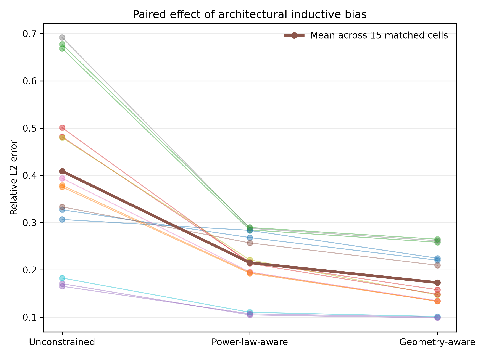
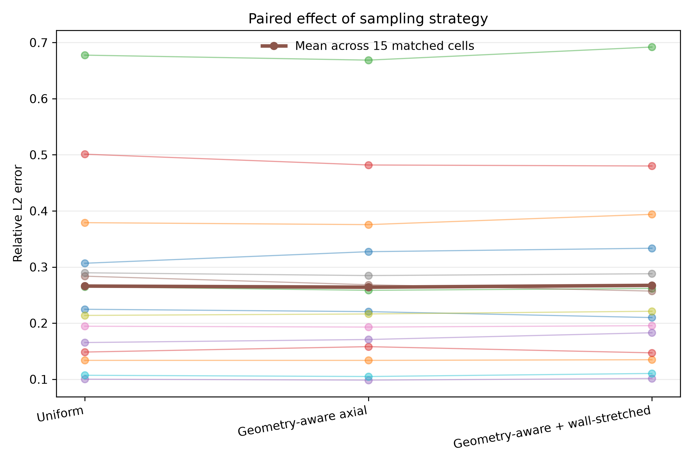
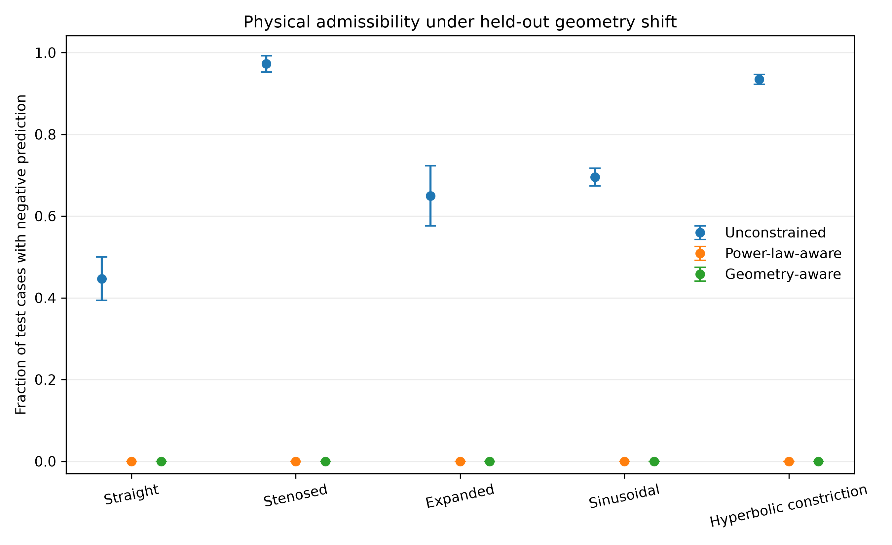
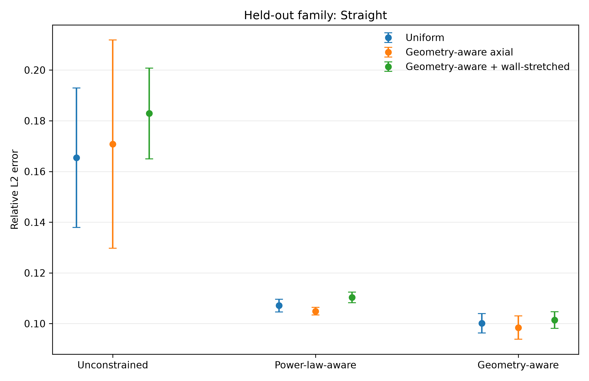
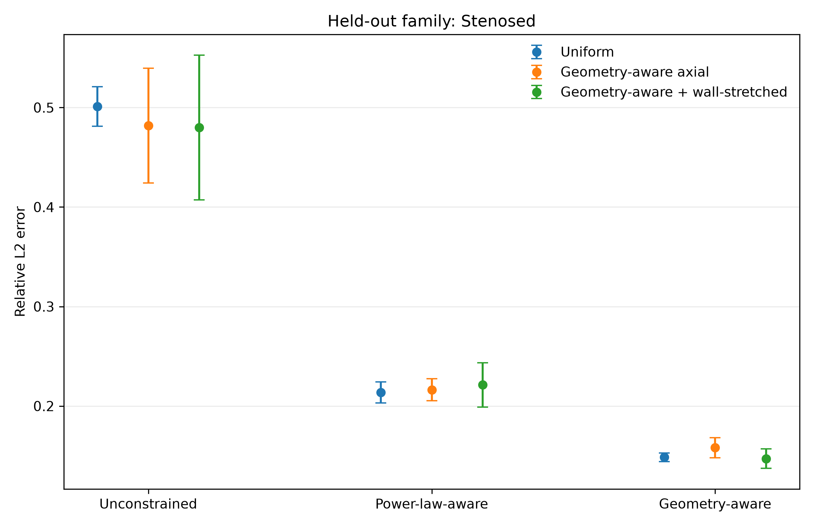
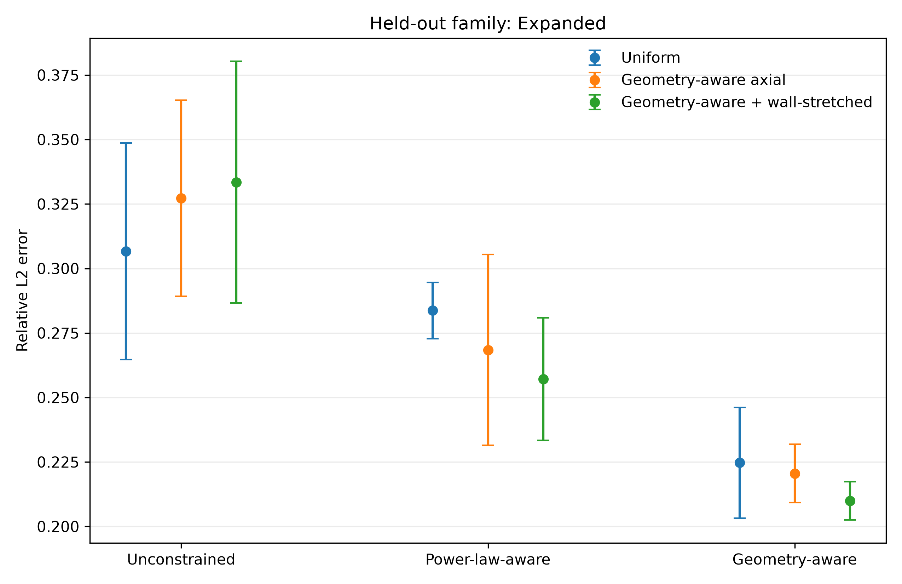
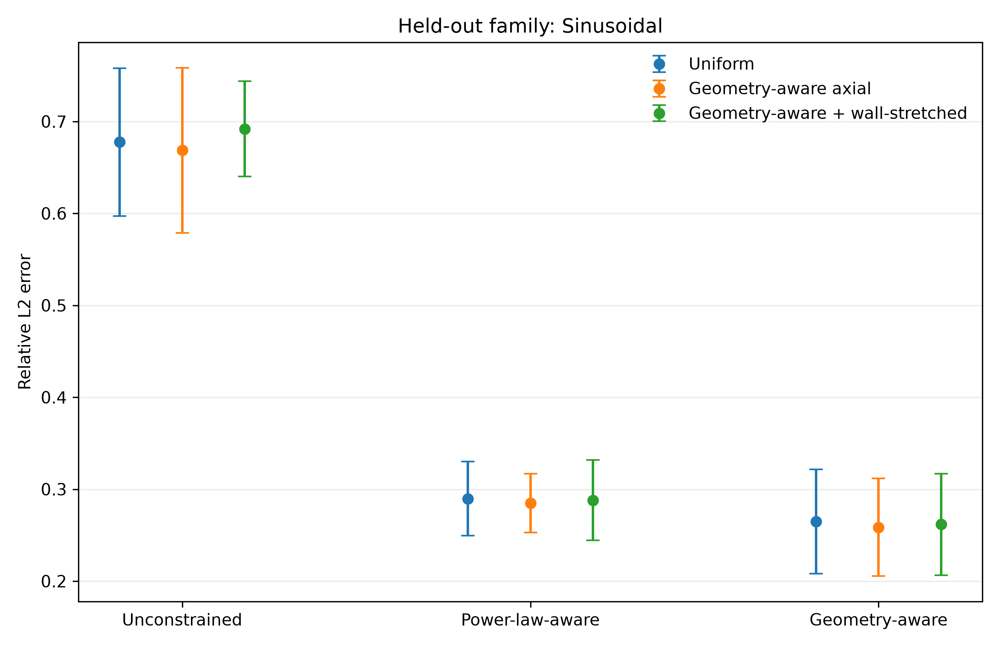
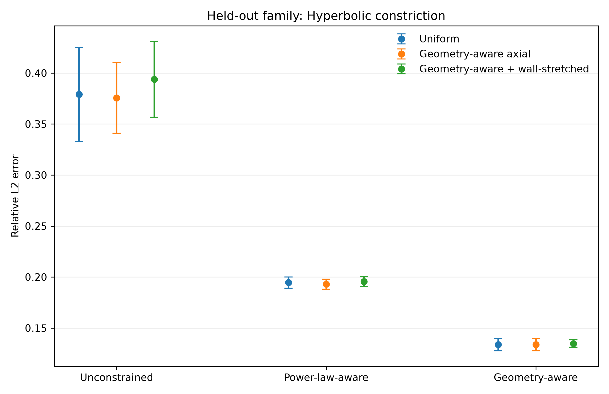

# Operator Generalization in Geometry-Varying Pipe Flow

Research code and manuscript materials for studying **generalization of neural operators to unseen pipe geometries**, with emphasis on the relative roles of:

* architectural and physical inductive bias,
* geometry representation,
* spatial sampling strategy,
* extrapolation across geometry families.

The main model family is **DeepONet**, evaluated on Newtonian and power-law internal-flow problems over varying pipe geometries.

---

## Research Question

When a neural operator is required to predict flow in an entire geometry family that was not observed during training, what matters more for generalization:

1. **architectural / physical inductive bias**, or
2. **how training points are sampled from the physical domain**?

We investigate this using a fully crossed **leave-one-geometry-family-out** experiment.

---

# Main Result

The central experiment contains:

* **3 architectures**
* **3 sampling strategies**
* **5 held-out geometry families**
* **5 random seeds**

for a total of:

[
3 \times 3 \times 5 \times 5 = 225
]

independent training runs.

Across the 15 matched `sampling × held-out-family` conditions, increasing architectural inductive bias consistently reduced out-of-family prediction error:

| Architecture    | Mean relative L2 error |
| --------------- | ---------------------: |
| Unconstrained   |             **0.4091** |
| Power-law-aware |             **0.2152** |
| Geometry-aware  |             **0.1731** |

The ordering

**Geometry-aware < Power-law-aware < Unconstrained**

was observed in **15/15 matched cells**.

Relative to the unconstrained architecture:

* Power-law-aware reduced mean error by approximately **47%**
* Geometry-aware reduced mean error by approximately **58%**

Geometry-aware further reduced error by approximately **20%** relative to the power-law-aware model.

---

## Architecture Matters More Than Sampling

The architecture effect is large and systematic:



By contrast, changing the sampling strategy produced only small changes in aggregate error:

| Sampling strategy                      | Mean relative L2 error |
| -------------------------------------- | ---------------------: |
| Uniform                                |             **0.2660** |
| Geometry-aware axial                   |             **0.2641** |
| Geometry-aware + wall-stretched radial |             **0.2673** |



The aggregate results therefore support the main conclusion:

> **For held-out geometry-family generalization in this problem, architectural inductive bias has a much larger and more consistent effect than changing the spatial sampling strategy alone.**

---

# Statistical Evidence

The comparison was performed using the 15 matched experimental cells.

### Architecture

A Friedman test detected a strong architecture effect:

[
p = 3.06\times10^{-7}.
]

Holm-corrected paired Wilcoxon tests gave:

| Comparison                       | Error reduction | Holm-corrected p |
| -------------------------------- | --------------: | ---------------: |
| Unconstrained → Power-law-aware  |       **47.4%** |    **1.83×10⁻⁴** |
| Unconstrained → Geometry-aware   |       **57.7%** |    **1.83×10⁻⁴** |
| Power-law-aware → Geometry-aware |       **19.6%** |    **1.83×10⁻⁴** |

The matched rank-biserial effect size was **1.0** for all three architecture comparisons, reflecting the consistent ordering across all 15 matched cells.

### Sampling

For sampling strategy, the Friedman test gave:

[
p = 0.0743.
]

No pairwise sampling comparison remained statistically significant after Holm correction.

Full statistical outputs are available in:

* [`results/stats_global.csv`](results/stats_global.csv)
* [`results/stats_pairwise.csv`](results/stats_pairwise.csv)

---

# Physical Admissibility

The unconstrained model frequently produces physically inadmissible negative velocity predictions under held-out geometry shifts.

The constrained architectures eliminate these failures in the present experiment:



Across the reported held-out tests:

* **Power-law-aware:** zero negative-velocity predictions
* **Geometry-aware:** zero negative-velocity predictions
* **Unconstrained:** frequent negative predictions, particularly for stenosed and hyperbolic-constriction geometries

This provides a second benefit of architectural constraints beyond reduction in relative L2 error.

---

# Held-Out Geometry Results

Generalization is tested by removing an entire geometry family from training and evaluating exclusively on that unseen family.

The five held-out families are:

1. Straight
2. Stenosed
3. Expanded
4. Sinusoidal
5. Hyperbolic constriction

### Straight



### Stenosed



### Expanded



### Sinusoidal



### Hyperbolic constriction



The same architecture ordering is observed in all 15 combinations of held-out family and sampling strategy.

The full consistency table is available at:

[`results/claim_consistency.csv`](results/claim_consistency.csv)

---

# Experimental Design

## Architectures

Three model variants are included in the main crossed experiment:

### 1. Unconstrained

Standard DeepONet prediction without the physical output constraints used by the other variants.

### 2. Power-law-aware

Introduces physically motivated structure associated with the radial velocity profile and flow behavior.

### 3. Geometry-aware

Adds explicit geometry-dependent inductive structure to the constrained operator model.

---

## Sampling Strategies

Three training-point sampling strategies are compared.

### Uniform

Uniform sampling in the computational domain.

### Geometry-aware axial

Axial samples are preferentially allocated according to local geometry variation.

### Geometry-aware + wall-stretched radial

Geometry-aware axial sampling is combined with radial sampling concentrated toward the pipe wall.

---

## Leave-One-Family-Out Protocol

For each experiment:

* four geometry families are available during training,
* the fifth geometry family is completely excluded,
* evaluation is performed only on the excluded family.

The process is repeated for all five families.

Each `architecture × sampling × held-out-family` cell is trained with five random seeds:

```text
00
01
02
03
04
```

This gives 45 experimental cells and 225 total training runs.

---

# Ground-Truth / Forward Model

The training and test targets in the current dataset are generated using the reduced forward model implemented in:

```text
src/forward_solver.py
```

For the straight-pipe case, this is consistent with the classical fully developed pipe-flow solution.

For spatially varying geometries, including stenosed, expanded, sinusoidal, and hyperbolic-constriction pipes, the solver uses a **reduced locally fully developed / lubrication-type approximation** based on the local radius (R(z)).

Therefore, the present experiments demonstrate:

> **generalization to unseen geometry families relative to the reduced forward operator.**

They should not yet be interpreted as validation against a full Navier–Stokes CFD solution.

A separate CFD spot-check is planned as an additional validation stage.

---

# Reproducibility

## Main experiment grid

A single experiment cell can be executed with:

```bash
python src/run_cross_grid_cell.py \
  --arch geoaware \
  --sampling geo-wallstretched \
  --held-out sinusoidal \
  --seed 0 \
  --epochs 1000
```

Each run produces:

```text
config.json
per_sample.csv
predictions.npz
train_curve.csv
model.pt
timing.json
```

Run directories follow the convention:

```text
runs/{arch}__{sampling}__holdout-{geometry}__seed-{seed}/
```

Example:

```text
runs/geoaware__geo-wallstretched__holdout-sinusoidal__seed-03/
```

---

## Full 225-run sweep

The complete experiment can be launched with:

```bash
python run_full_grid.py
```

The launcher is resume-safe:

* completed runs are skipped,
* incomplete run directories trigger a stop instead of silent overwrite,
* run configuration is recorded for reproducibility.

---

## Aggregate Results

Aggregate all completed runs with:

```bash
python build_master_table.py --strict
```

The final crossed experiment contains:

```text
Expected runs : 225
Complete runs : 225
Missing runs  : 0
Invalid runs  : 0

Expected cells: 45
Complete cells: 45
```

The full cell-level results are available in:

[`results/master_table.csv`](results/master_table.csv)

Additional derived tables include:

* [`results/effect_inductive_bias.csv`](results/effect_inductive_bias.csv)
* [`results/effect_sampling.csv`](results/effect_sampling.csv)
* [`results/fluid_breakdown.csv`](results/fluid_breakdown.csv)
* [`results/claim_consistency.csv`](results/claim_consistency.csv)

---

# Statistical Analysis

Run:

```bash
python analyze_cross_grid_statistics.py
```

This produces:

```text
results/stats_global.csv
results/stats_pairwise.csv
figures/paired_architecture_effect.png
figures/paired_sampling_effect.png
```

The analysis uses:

* Friedman tests for the overall architecture and sampling effects,
* paired Wilcoxon signed-rank tests,
* Holm correction for multiple comparisons,
* matched rank-biserial effect sizes.

---

# Repository Structure

```text
.
├── data/                 # Forward-operator dataset
├── docs/                 # Supporting research notes
├── figures/              # Generated figures
├── models/               # Earlier trained checkpoints
├── paper/                # Manuscript materials
├── results/              # Raw and aggregate experiment results
├── src/                  # Dataset, model, training and evaluation code
│
├── run_full_grid.py
├── build_master_table.py
├── plot_cross_grid_results.py
├── analyze_cross_grid_statistics.py
├── requirements.txt
└── README.md
```

---

# Key Code

### Dataset generation

```text
src/generate_forward_operator_dataset.py
```

### Reduced forward solver

```text
src/forward_solver.py
```

### DeepONet training

```text
src/train_deeponet_forward.py
src/train_deeponet_forward_positive.py
src/train_deeponet_forward_powerlaw_constraint.py
src/train_deeponet_forward_geometry_aware.py
```

### Geometry-generalization experiments

```text
src/train_deeponet_leave_one_geometry_out.py
src/train_deeponet_leave_one_geometry_out_sampling_ablation.py
src/run_cross_grid_cell.py
```

### Cross-grid analysis

```text
run_full_grid.py
build_master_table.py
plot_cross_grid_results.py
analyze_cross_grid_statistics.py
```

---

# Installation

```bash
python -m venv .venv
source .venv/bin/activate
pip install -r requirements.txt
```

The experiments automatically use Apple MPS when available.

---

# Manuscript

The developing manuscript is located in:

```text
paper/
```

Individual sections are maintained under:

```text
paper/sections/
```

The current manuscript focuses specifically on:

* operator generalization under geometry-family distribution shift,
* architectural inductive bias,
* spatial sampling strategy,
* physical admissibility of neural-operator predictions.

Inverse rheology and earlier MLP/PINN pipe-flow benchmarks are maintained as separate research directions and are not part of this repository.

---

# Current Status

### Completed

* [x] Forward-operator dataset
* [x] DeepONet baselines
* [x] Power-law-aware architecture
* [x] Geometry-aware architecture
* [x] Five leave-one-geometry-family-out evaluations
* [x] Three sampling strategies
* [x] Five-seed evaluation
* [x] Full 225-run crossed experiment
* [x] Per-sample raw error storage
* [x] Aggregate result tables
* [x] Statistical comparison
* [x] Physical-admissibility analysis

### Next validation step

* [ ] CFD spot-check on selected unseen geometries

The CFD comparison is intentionally treated as a separate validation stage rather than being mixed with the reduced-forward-operator benchmark.
